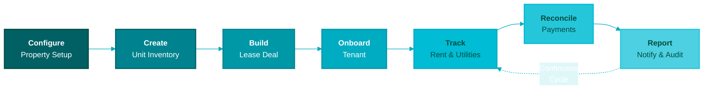
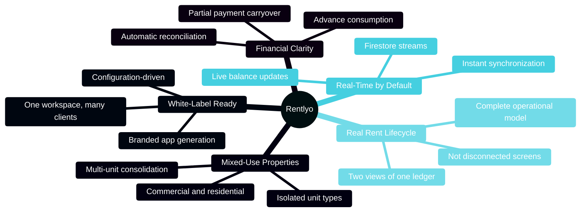
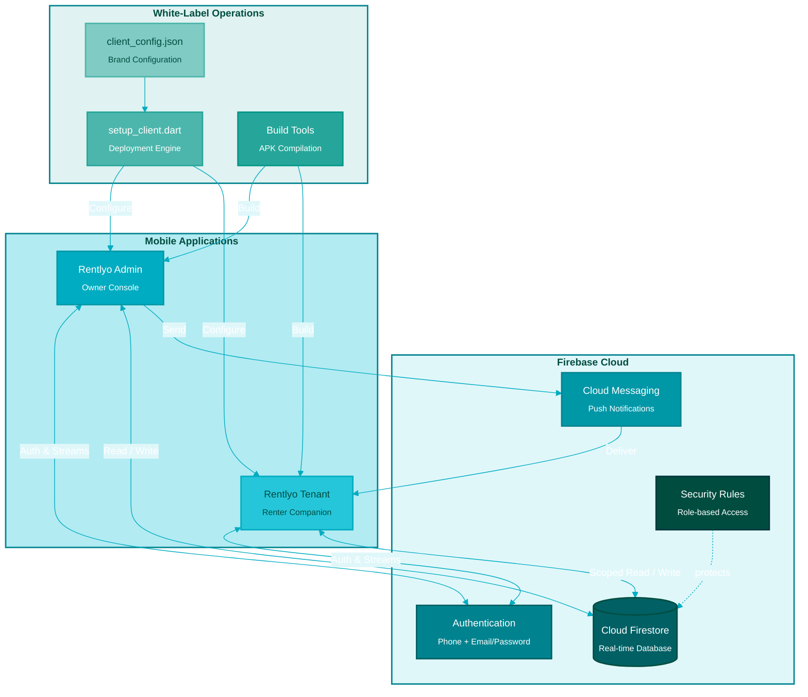
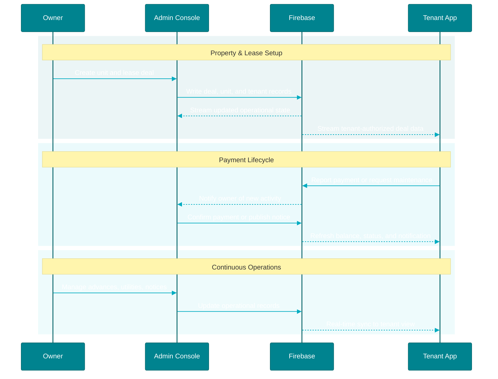
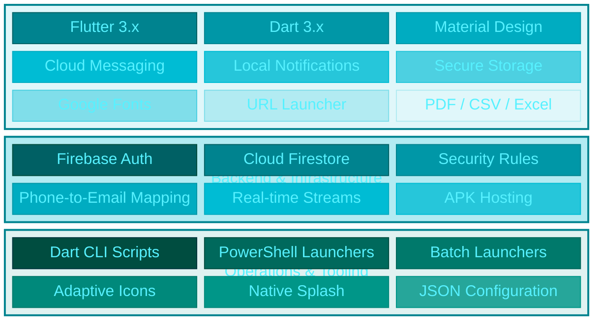
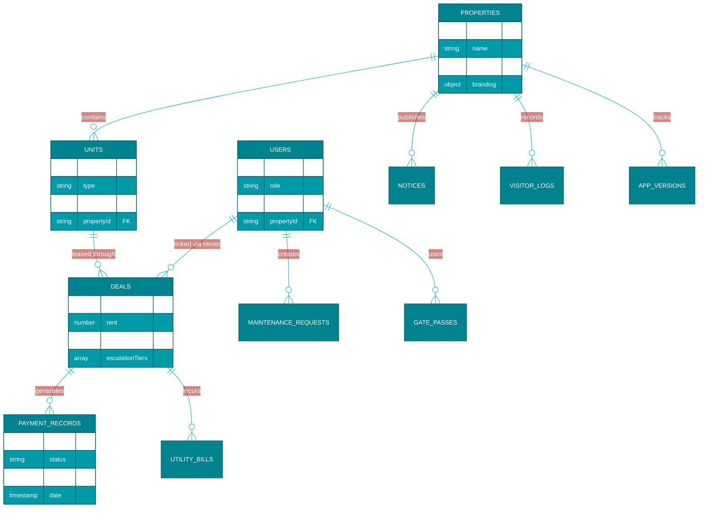
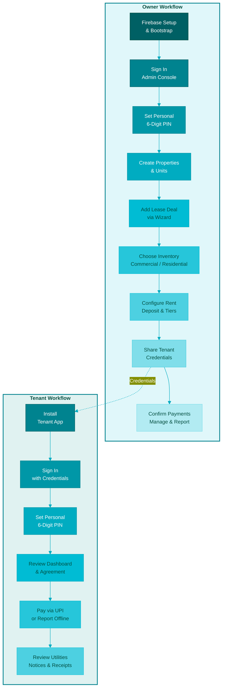
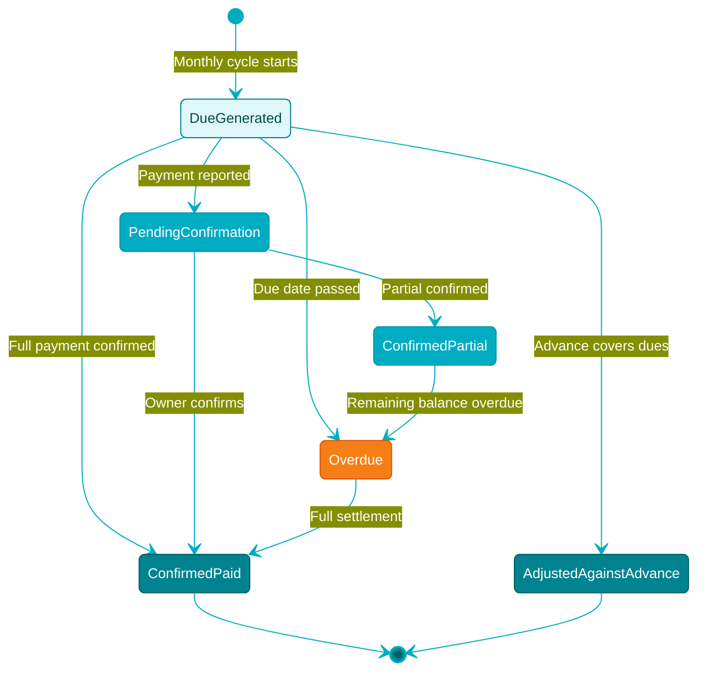
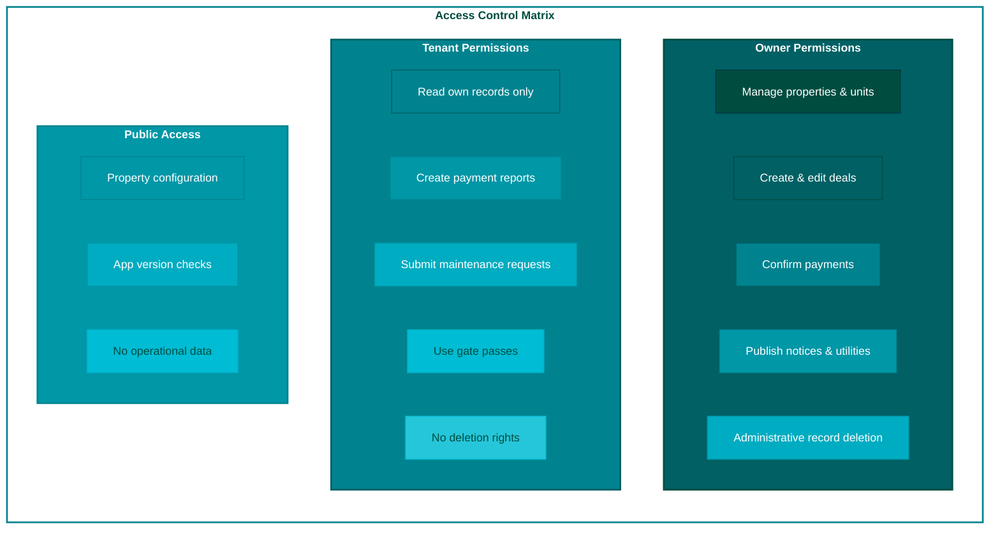

<div align="center">


<br><br>

**Complete White-Label Property Management Suite**
<br>
*Leases, ledgers, tenants, and properties in one synchronized workspace.*

<br>

[](https://flutter.dev/)
[](https://dart.dev/)
[](https://firebase.google.com/)
[](https://www.android.com/)
[](#license)

<br>

[Get Started](#-quick-start) · [Architecture](#-system-architecture) · [Deploy a Client](#-client-onboarding--white-label-setup) · [Website](https://rentlyo.cscouncil.in/)

<br>

---

</div>

<br>

## The Rentlyo Ecosystem

> **One platform. Two focused apps. One synchronized property workspace.**
>
> Built for commercial shops, residential flats, rooms, beds, and mixed-use properties where owners need reliable rent operations and tenants need a clear, trustworthy lease portal.



<br>

---

## Table of Contents

<table>
<tr>
<td width="50%" valign="top">

#### Platform
- [The Rentlyo Ecosystem](#the-rentlyo-ecosystem)
- [What Rentlyo Includes](#-what-rentlyo-includes)
- [Why It Is Different](#-why-it-is-different)
- [Product Capabilities](#-product-capabilities)

#### Architecture
- [System Architecture](#-system-architecture)
- [Technology Stack](#-technology-stack)
- [Repository Layout](#-repository-layout)
- [Security Model](#-security-model)

</td>
<td width="50%" valign="top">

#### Operations
- [Quick Start](#-quick-start)
- [Client Onboarding & White-Label Setup](#-client-onboarding--white-label-setup)
- [Firebase Setup](#-firebase-setup)
- [Application Workflows](#-application-workflows)

#### Engineering
- [Financial & Operational Engines](#-financial--operational-engines)
- [Build & Release](#-build--release)
- [Testing](#-testing)
- [Production Checklist](#-production-checklist)
- [Troubleshooting](#-troubleshooting)

</td>
</tr>
</table>

<br>

---

## What Rentlyo Includes

<table>
<tr>
<td width="33%" valign="top">

### Tenant App

*Private lease and rent companion for renters, shopkeepers, and residential occupants.*

| Feature | |
|:---|:---:|
| Live dashboard with current dues |  |
| Agreement and deal summary |  |
| Rent schedules with step-up tiers |  |
| Full payment and installment ledger |  |
| Partial-payment & advance tracking |  |
| One-tap UPI payment handoff |  |
| Payment receipt via WhatsApp |  |
| Utility bill & sub-meter history |  |
| Digital gate passes |  |
| Push notifications & reminders |  |
| Secure PIN unlock |  |
| In-app update notifications |  |

</td>
<td width="33%" valign="top">

### Admin Console

*Focused operating console for property owners, managers, and accounting staff.*

| Feature | |
|:---|:---:|
| Dashboard occupancy overview |  |
| Commercial & residential units |  |
| Multi-unit deal creation |  |
| Tenant onboarding wizard |  |
| Lease & escalation tiers |  |
| Advance deposit management |  |
| Auto ledger rebalancing |  |
| Electricity & water billing |  |
| PDF, CSV, and Excel reports |  |
| Multi-property switching |  |
| OTA release management |  |
| Owner PIN authentication |  |

</td>
<td width="33%" valign="top">

### White-Label Engine

*Reusable deployment layer for new properties, brands, or clients.*

| Feature | |
|:---|:---:|
| Central `client_config.json` |  |
| Auto Firebase project discovery |  |
| Brand name, colors, contacts |  |
| Client logo & banner distribution |  |
| Android package synchronization |  |
| Adaptive icon generation |  |
| Native splash screen generation |  |
| Firebase owner bootstrap |  |
| Firestore seed & verification |  |
| Pre-flight diagnostics |  |
| Dual release APK compilation |  |
| Database cleaning utility |  |

</td>
</tr>
</table>

<br>

---

## Why It Is Different



<details>
<summary><b>Built around the real rent lifecycle</b></summary>
<br>

Rentlyo models the relationship between a property, its units, a lease deal, a tenant, an advance balance, monthly rent, payment records, utilities, and notices. The apps are not disconnected screens; they are **two views of the same operational ledger**.

</details>

<details>
<summary><b>Real-time by default</b></summary>
<br>

Firestore streams keep deal information, advance top-ups, notices, payment states, and property branding synchronized between the admin and tenant experiences. Changes propagate instantly without manual refresh.

</details>

<details>
<summary><b>White-label at the configuration layer</b></summary>
<br>

A new client can receive branded applications **without rebuilding the product architecture**. The setup engine distributes assets, rewrites generated configuration, prepares Firebase connectivity, and can build both release APKs from one workspace.

</details>

<details>
<summary><b>Designed for mixed-use properties</b></summary>
<br>

Commercial and residential inventory can coexist while remaining separated during onboarding and vacancy selection. Multi-unit deals can be consolidated without losing unit-level occupancy state.

</details>

<details>
<summary><b>Financial clarity over manual arithmetic</b></summary>
<br>

The shared rent engine handles advance consumption, partial payments, overdue carryover, rent escalations, and payment status reconciliation so owners and tenants see the same outcome.

</details>

<br>

---

## Product Capabilities

<table>
<tr>
<th align="left">Capability</th>
<th align="center">Tenant App</th>
<th align="center">Admin Console</th>
</tr>
<tr><td><b>Live rent balance</b></td><td align="center"></td><td align="center"></td></tr>
<tr><td><b>Lease and deal terms</b></td><td align="center"></td><td align="center"></td></tr>
<tr><td><b>Advance balance and top-ups</b></td><td align="center"></td><td align="center"></td></tr>
<tr><td><b>Payment ledger</b></td><td align="center"></td><td align="center"></td></tr>
<tr><td><b>Rent escalation tiers</b></td><td align="center"></td><td align="center"></td></tr>
<tr><td><b>Unit inventory</b></td><td align="center"></td><td align="center"></td></tr>
<tr><td><b>Tenant onboarding</b></td><td align="center"></td><td align="center"></td></tr>
<tr><td><b>Maintenance requests</b></td><td align="center"></td><td align="center"></td></tr>
<tr><td><b>Utility billing</b></td><td align="center"></td><td align="center"></td></tr>
<tr><td><b>Notices and announcements</b></td><td align="center"></td><td align="center"></td></tr>
<tr><td><b>Gate passes and visitor logs</b></td><td align="center"></td><td align="center"></td></tr>
<tr><td><b>Multi-property switching</b></td><td align="center"></td><td align="center"></td></tr>
<tr><td><b>PDF/CSV/Excel reporting</b></td><td align="center"></td><td align="center"></td></tr>
<tr><td><b>Release update management</b></td><td align="center"></td><td align="center"></td></tr>
</table>

<br>

---

## System Architecture



<details>
<summary><b>Data Flow Principles</b></summary>
<br>



**Five core principles drive the data flow:**

1. An owner creates properties, units, and lease deals in the Admin Console.
2. Firestore stores the **canonical operational state**.
3. The Tenant App reads only the tenant's permitted records through **authenticated streams**.
4. Payment, advance, utility, notice, and occupancy changes appear in both apps **in real time**.
5. Firestore rules enforce owner access and tenant ownership boundaries **at the database layer**.

</details>

<br>

---

## Technology Stack



> The current release configuration is optimized for **Android APK distribution**. The Flutter projects can target additional platforms with standard Flutter tooling, but platform-specific Firebase configuration, signing, and release validation must be completed first.

<br>

---

## Repository Layout

```
Rentlyo/
├── Rentlyo/                            Tenant-facing Flutter application
│   ├── lib/
│   │   ├── core/                       App configuration and shared services
│   │   ├── models/                     Tenant-side data models
│   │   ├── screens/                    Tenant experience screens
│   │   ├── services/                   Firebase, ledger, notification, update services
│   │   └── widgets/                    Reusable tenant UI components
│   ├── assets/images/                  Tenant branding assets
│   ├── android/                        Android project and Firebase configuration
│   ├── test/                           Tenant tests
│   └── pubspec.yaml                    Tenant dependencies
│
├── Rentlyo Admin/                      Owner and property-manager Flutter application
│   ├── lib/
│   │   ├── core/                       Admin configuration and shared services
│   │   ├── models/                     Admin-side data models
│   │   ├── screens/                    Admin workflows and dashboards
│   │   ├── services/                   Firebase, reports, auth, ledger services
│   │   └── widgets/                    Reusable admin UI components
│   ├── assets/images/                  Admin branding assets
│   ├── android/                        Android project and Firebase configuration
│   ├── test/                           Admin tests
│   └── pubspec.yaml                    Admin dependencies
│
├── scripts/                            Dart automation tools
│   ├── setup_client.dart               Client deployment engine
│   ├── bootstrap_admin.dart            Owner auth bootstrap
│   ├── clean_database.dart             Test-data purge utility
│   └── update_version.dart             Firestore-backed release publisher
│
├── client_assets/                      Client logo and Firebase config
├── assets/                             Shared image assets and logos
├── client_config.json                  White-label configuration source
├── firestore.rules                     Firestore authorization rules
├── setup_new_client.bat                Windows one-click launcher
├── setup_new_client.ps1                PowerShell launcher
└── MASTER_PRODUCTION_AND_CLIENT_DEPLOYMENT_GUIDE.md
```

> Build output folders such as `build/` and `.dart_tool/` are generated artifacts. Do not copy them into a new client workspace or commit them to source control.

<br>

---

## Quick Start

### Prerequisites

| Requirement | Version |
|:---|:---|
|  | 10 or later |
|  | SDK with Dart 3.x |
|  | Android Studio + SDK |
|  | Auth + Firestore enabled |
|  | For source control |

**Verify the toolchain:**

```powershell
flutter doctor
flutter --version
dart --version
```

### Step-by-Step

<details>
<summary><b>1. Fetch dependencies</b></summary>

```powershell
cd "Rentlyo"
flutter pub get

cd "..\Rentlyo Admin"
flutter pub get
```

</details>

<details>
<summary><b>2. Configure Firebase</b></summary>

Place the correct Firebase Android configuration in each app's Android module, or place a source copy at:

```
client_assets/google-services.json
```

The deployment tooling can distribute the Firebase configuration to both applications.

</details>

<details>
<summary><b>3. Run the apps</b></summary>

**Tenant application:**
```powershell
cd "Rentlyo"
flutter run
```

**Admin application:**
```powershell
cd "..\Rentlyo Admin"
flutter run
```

</details>

<details>
<summary><b>4. Run tests</b></summary>

```powershell
cd "Rentlyo"
flutter test

cd "..\Rentlyo Admin"
flutter test
```

</details>

<br>

---

## Client Onboarding & White-Label Setup

Rentlyo is structured so a new client or property can be prepared from one workspace.

```mermaid
%%{init: {'theme': 'base', 'themeVariables': {'primaryColor': '#00838F', 'primaryTextColor': '#FFFFFF', 'primaryBorderColor': '#006064', 'lineColor': '#00ACC1', 'fontSize': '14px'}}}%%
flowchart LR
    subgraph INPUT["<b>Client Inputs</b>"]
        direction TB
        GS["google-services.json"]
        LOGO["logo.png"]
        BANNER["banner.png<br/><sub>optional</sub>"]
        CFG["client_config.json"]
    end

    subgraph ENGINE["<b>Setup Engine</b>"]
        direction TB
        DETECT["Detect Firebase Project"]
        DIST["Distribute Assets"]
        BRAND["Apply Branding"]
        PKG["Update Package IDs"]
        ICON["Generate Icons & Splash"]
        BOOT["Bootstrap Owner"]
        SEED["Seed Firestore"]
    end

    subgraph OUTPUT["<b>Deliverables</b>"]
        direction TB
        APK_A["Admin APK"]
        APK_T["Tenant APK"]
        FB["Live Firebase Backend"]
    end

    INPUT --> ENGINE --> OUTPUT

    style INPUT fill:#E0F7FA,color:#004D40,stroke:#00838F,stroke-width:2px
    style ENGINE fill:#B2EBF2,color:#004D40,stroke:#00838F,stroke-width:2px
    style OUTPUT fill:#E0F2F1,color:#004D40,stroke:#00838F,stroke-width:2px
    style GS fill:#00838F,color:#FFFFFF,stroke:#006064
    style LOGO fill:#0097A7,color:#FFFFFF,stroke:#00838F
    style BANNER fill:#00ACC1,color:#FFFFFF,stroke:#0097A7
    style CFG fill:#00BCD4,color:#004D40,stroke:#00ACC1
    style DETECT fill:#006064,color:#FFFFFF,stroke:#004D40
    style DIST fill:#00838F,color:#FFFFFF,stroke:#006064
    style BRAND fill:#0097A7,color:#FFFFFF,stroke:#00838F
    style PKG fill:#00ACC1,color:#FFFFFF,stroke:#0097A7
    style ICON fill:#00BCD4,color:#004D40,stroke:#00ACC1
    style BOOT fill:#26C6DA,color:#004D40,stroke:#00BCD4
    style SEED fill:#4DD0E1,color:#004D40,stroke:#26C6DA
    style APK_A fill:#00838F,color:#FFFFFF,stroke:#006064
    style APK_T fill:#0097A7,color:#FFFFFF,stroke:#00838F
    style FB fill:#006064,color:#FFFFFF,stroke:#004D40
```



<details>
<summary><b>Required client inputs</b></summary>
<br>

Place the following in `client_assets/`:

```
client_assets/
├── google-services.json     # Firebase Android configuration
├── logo.png                 # Square client logo
└── banner.png               # Optional property banner
```

Update `client_config.json` with the new client's:
- Property and brand identity
- App names and taglines
- Address and support contacts
- Owner UPI ID
- Primary, secondary, accent, and background colors
- Firebase project settings
- Default property ID and currency
- Owner bootstrap phone and initial password
- Android package identifiers

</details>

<details>
<summary><b>Launcher operations</b></summary>
<br>

From the repository root:

```powershell
.\setup_new_client.ps1
```

| Option | Operation |
|:---:|:---|
| `1` | Complete client setup, asset distribution, branding, Firebase bootstrap |
| `2` | Complete setup and build both release APKs |
| `3` | Pre-flight diagnostics and health check |
| `4` | Interactive configuration questionnaire |
| `5` | Clean or reset test data while retaining the owner account |
| `6` | Exit |

</details>

<details>
<summary><b>Direct Dart commands</b></summary>
<br>

```powershell
# Complete setup
dart scripts/setup_client.dart

# Complete setup plus both release APKs
dart scripts/setup_client.dart --all

# Verify keys, assets, package identifiers, and connectivity
dart scripts/setup_client.dart --verify

# Configure a client interactively
dart scripts/setup_client.dart --interactive
```

</details>

For the full operational walkthrough, read [MASTER_PRODUCTION_AND_CLIENT_DEPLOYMENT_GUIDE.md](MASTER_PRODUCTION_AND_CLIENT_DEPLOYMENT_GUIDE.md).

<br>

---

## Firebase Setup

<details>
<summary><b>Fresh client backend setup</b></summary>
<br>

1. Create a Firebase project.
2. Enable Email/Password authentication.
3. Create a Cloud Firestore database in production mode.
4. Publish the rules from [firestore.rules](firestore.rules).
5. Register the Admin and Tenant Android applications.
6. Download `google-services.json`.
7. Place it in `client_assets/` and run the verification or setup command.

</details>

<details>
<summary><b>Authentication model</b></summary>
<br>

Rentlyo uses an internal pseudo-email mapping so users can sign in with a mobile number and password while using Firebase Email/Password authentication:

```
9876543210  -->  9876543210@rentlyo.local
```

The mapping is an implementation detail. The user experience remains a mobile-number login, while Firebase handles authentication and token issuance.

</details>

<details>
<summary><b>Core Firestore collections</b></summary>
<br>



| Collection | Purpose |
|:---|:---|
| `users` | Owner and tenant profiles, roles, and renter relationships |
| `properties` | Property identity, branding, contacts, and configuration |
| `units` | Shops, flats, rooms, beds, and occupancy state |
| `deals` | Lease terms, rent schedules, deposits, and tenant links |
| `paymentRecords` | Monthly rent records, installments, and payment states |
| `maintenanceRequests` | Tenant issues and owner resolution workflows |
| `notices` | Property-wide and tenant-facing announcements |
| `utilityBills` | Electricity and water sub-meter charges |
| `gatePasses` | Digital tenant and visitor passes |
| `visitorLogs` | Entry and exit activity |
| `messMenus` | Optional mess or canteen menu data |
| `notifications` | User-targeted alerts and notification state |
| `appVersions` | Latest version, minimum version, download URL, and notes |

</details>

<br>

---

## Application Workflows



<details>
<summary><b>Multi-unit and multi-property workflow</b></summary>
<br>

- Multi-unit deals are consolidated under one active lease while each selected unit remains represented in occupancy data.
- Secondary units in a consolidated deal are marked occupied and removed from vacant selection.
- Commercial and residential unit types remain isolated during onboarding.
- Owners can switch property context from the Admin Console without maintaining separate application installations.

</details>

<br>

---

## Financial & Operational Engines

### Rent & Advance Reconciliation



<details>
<summary><b>Engine capabilities</b></summary>
<br>

The shared rent engine supports:
- Monthly due calculation
- Partial-payment carryover
- Overdue balance accumulation
- Advance balance consumption
- Advance top-ups
- Payment status reconciliation
- Rent step-up tiers over time
- Current-period settlement visibility

</details>

<details>
<summary><b>Utility billing formula</b></summary>
<br>

For electricity and water sub-meters:

```
units consumed = current reading - previous reading
utility charge  = units consumed x rate per unit
monthly total   = rent + utility charge + applicable adjustments
```

The Admin Console can publish utility charges while the Tenant App exposes the resulting history and statement context.

</details>

<details>
<summary><b>Notification logic</b></summary>
<br>

Automated notification logic can:
- Notify tenants about the rent cycle
- Reflect whether rent is paid, partially paid, overdue, or covered by advance
- Remove obsolete overdue alerts after settlement
- Publish owner-authored property notices
- Deliver app release prompts when a newer version is available

</details>

<details>
<summary><b>Live property branding</b></summary>
<br>

Property-level settings can be stored in Firestore so contact details, UPI information, and selected branding values can be reflected through cloud configuration. Changes affect the tenant experience immediately and must be tested carefully in production.

</details>

<br>

---

## Security Model



Review [firestore.rules](firestore.rules) before every production deployment. Security rules are part of the application boundary, not an optional deployment detail.

<details>
<summary><b>Credential and secret handling</b></summary>
<br>

> **Do not commit real credentials, private keys, owner passwords, or client Firebase configuration to a public repository.**

Before publishing this project publicly:

1. Remove or rotate any real Firebase API keys and owner credentials present in local configuration.
2. Keep client-specific `google-services.json` files private.
3. Add local-only configuration files to `.gitignore` where appropriate.
4. Use a sanitized example configuration for documentation and onboarding.
5. Change bootstrap passwords immediately after first owner login.
6. Treat database reset and bootstrap commands as privileged operations.
7. Validate Firestore rules with a separate test Firebase project before production rollout.

Firebase web API keys are not substitutes for access control. Authentication, Firestore rules, package signing, and operational credential hygiene must all be maintained.

</details>

<br>

---

## Build & Release

<details>
<summary><b>Debug builds</b></summary>

```powershell
cd "Rentlyo"
flutter build apk --debug

cd "..\Rentlyo Admin"
flutter build apk --debug
```

</details>

<details>
<summary><b>Release builds</b></summary>

```powershell
cd "Rentlyo"
flutter build apk --release

cd "..\Rentlyo Admin"
flutter build apk --release
```

Or from the root launcher:

```powershell
.\setup_new_client.ps1
# Choose option 2
```

</details>

<details>
<summary><b>APK locations</b></summary>

```
Rentlyo/build/app/outputs/flutter-apk/app-release.apk
Rentlyo Admin/build/app/outputs/flutter-apk/app-release.apk
```

</details>

<details>
<summary><b>Pre-distribution checklist</b></summary>
<br>

- [ ] App label and package ID are correct
- [ ] Client logo and splash screen are correct
- [ ] Firebase project is the intended client project
- [ ] Release is signed with the correct key
- [ ] Login works for both owner and tenant roles
- [ ] Firestore rules reject unauthorized reads and writes
- [ ] UPI, WhatsApp, notifications, file downloads, and update prompts work on a real device

</details>

### In-App Updates

Publish a release with:

```powershell
dart scripts/update_version.dart `
  rentlyo_renter `
  1.0.1 `
  2 `
  1.0.0 `
  "https://github.com/OWNER/REPOSITORY/releases/download/v1.0.1/renter.apk" `
  "Bug fixes and improvements"
```

For the Admin Console, use `rentlyo_admin` as the app ID:

```powershell
dart scripts/update_version.dart rentlyo_admin 1.0.1 2 1.0.0 "https://example.com/admin.apk" "Release notes"
```

<details>
<summary><b>Version document fields</b></summary>
<br>

The command authenticates as the owner and updates the release document with:

- Latest semantic version
- Build number
- Minimum required version
- APK download URL
- Release notes

Only publish URLs that are stable, accessible to the intended users, and protected by your release process.

</details>

<br>

---

## Database Operations

The database cleaner is intended for development, demo, and test reset scenarios.

```powershell
# Interactive reset
dart scripts/clean_database.dart

# Keep units while cleaning transactional records
dart scripts/clean_database.dart --keep-units

# Non-interactive reset (controlled environment only)
dart scripts/clean_database.dart --force
```

> The reset operation can remove deals, payment records, units, maintenance requests, utility bills, gate passes, visitor logs, menus, notifications, notices, and non-owner user profiles. **Confirm the target Firebase project before running it.**

<br>

---

## Testing

```powershell
# Tenant tests
cd "Rentlyo"
flutter test

# Admin tests
cd "..\Rentlyo Admin"
flutter test
```

<details>
<summary><b>Test coverage areas</b></summary>
<br>

- Rent and advance calculation
- Model behavior
- Security-related model constraints
- Unit-type separation
- Widget behavior
- Admin workflows

For production releases, supplement unit and widget tests with a real-device acceptance pass against a non-production Firebase project.

</details>

<br>

---

## Troubleshooting

| Symptom | Resolution |
|:---|:---|
| `setup_client.dart` not found | Run the launcher from the repository root; keep `scripts/` beside the launcher. |
| Dart or Flutter not found | Install Flutter, add to `PATH`, run `flutter doctor`. |
| Owner login fails | Run complete setup or bootstrap flow; verify Firebase project and owner credentials. |
| Firebase project mismatch | Replace `client_assets/google-services.json`, verify `client_config.json`, run `--verify`. |
| No units appear | Check property context in Admin Console; verify unit documents in Firestore. |
| Wrong branding appears | Update `client_config.json` and assets, then re-run client setup. |
| APK cannot install | Check Android signing, package ID, device compatibility, and Play Protect warnings. |
| Updates do not appear | Verify `appVersions` document, minimum version, APK URL, and Firestore read rules. |
| Reset command blocked | Use interactive confirmation or provide `--force` only after verifying target project. |

**Run the pre-flight check first:**

```powershell
dart scripts/setup_client.dart --verify
```

<br>

---

## Production Checklist

<details>
<summary><b>Configuration</b></summary>

- [ ] Client name, brand name, property ID, address, and currency are correct.
- [ ] App names, taglines, colors, logo, and optional banner are correct.
- [ ] Support phone, WhatsApp number, email, and UPI ID are correct.
- [ ] Firebase project and Android package identifiers are correct.

</details>

<details>
<summary><b>Backend</b></summary>

- [ ] Email/Password authentication is enabled.
- [ ] Firestore is in the intended region and mode.
- [ ] Current [firestore.rules](firestore.rules) are published.
- [ ] Owner bootstrap completed successfully.
- [ ] No test tenant records remain.
- [ ] No client secrets are exposed in source control.

</details>

<details>
<summary><b>Application</b></summary>

- [ ] Owner login and PIN unlock work.
- [ ] Tenant login and PIN unlock work.
- [ ] Commercial/residential unit separation works.
- [ ] Multi-unit deal occupancy is correct.
- [ ] Rent, advance, partial payment, and overdue calculations are correct.
- [ ] Utility billing and receipts are correct.
- [ ] Notices, notifications, maintenance, gate passes, and visitor logs work.
- [ ] UPI and WhatsApp handoffs work on a real device.
- [ ] Release APKs are signed and versioned.
- [ ] Update metadata points to the correct artifacts.

</details>

<br>

---

## Documentation

| Document | Description |
|:---|:---|
| [Master Production & Deployment Guide](MASTER_PRODUCTION_AND_CLIENT_DEPLOYMENT_GUIDE.md) | Full operational walkthrough |
| [Tenant Application README](Rentlyo/README.md) | Screen-level feature notes |
| [Admin Console README](Rentlyo%20Admin/README.md) | Admin workflow details |
| [Firestore Security Rules](firestore.rules) | Role-based access definitions |
| [Client Configuration](client_config.json) | White-label config source |

<br>

---

## License

This project is **private and proprietary software** unless a separate written license says otherwise. The source code, branding, configuration, deployment scripts, Firebase rules, and generated client applications may not be redistributed, resold, or deployed for another party without authorization from the project owner.

<br>

---

<div align="center">


<br><br>

**Rentlyo**

*Clear leases. Reliable ledgers. Better property operations.*

Built as a complete, configurable property-management platform for the real world.

<br>

[](https://rentlyo.cscouncil.in/)

<br>

<sub>Built with Flutter, Firebase, and Dart</sub>

</div>
